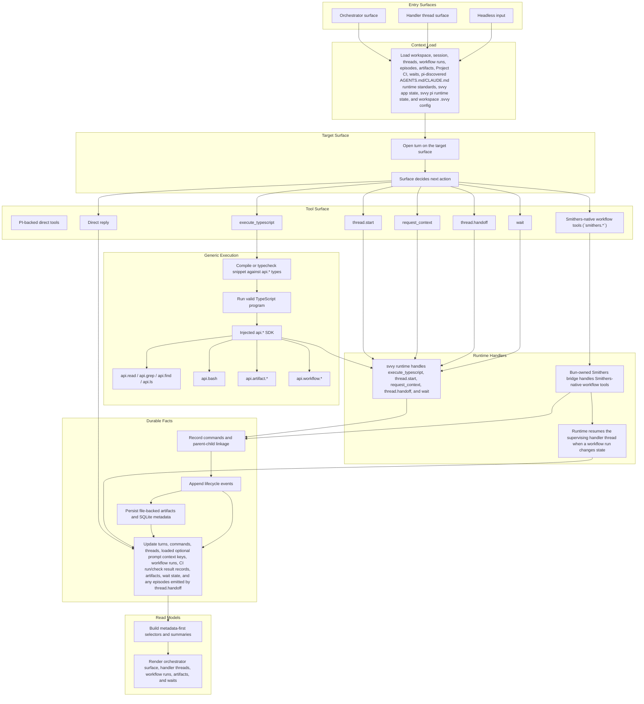

# Execution Model

This document is a companion to the [PRD](./prd.md).

It describes the intended product-level request flow for `svvy`.

It is a behavioral model, not a package layout or implementation call graph.

## Core Shape

The adopted model is one shared command system:

```text
message -> target surface -> turn -> tool call -> command -> handler -> events -> structured state -> UI
```

The target surface may be:

- the main orchestrator surface
- a delegated handler thread surface

The orchestrator remains the strategic brain.

Handler threads own one delegated objective at a time.

Smithers owns workflow execution under those handler threads.

## End-To-End Flow



## Practical Interpretation

### 1. Messages Target A Surface

Every send goes to one interactive surface.

That means:

- a message sent in the orchestrator pane goes to the orchestrator surface
- a message sent in a handler thread pane goes to that handler thread surface

This is shared surface behavior, not special logic for waiting threads only.

### 2. The Orchestrator Delegates Objectives, Not Raw Workflow Runs

The orchestrator typically chooses among:

- direct reply
- cx semantic navigation and direct tools
- `execute_typescript`
- `thread.start`
- `wait`

It normally does **not** supervise every workflow pause, rerun, and repair step itself.

The orchestrator prompt should know that handler threads can use Smithers workflow tools, but it should not receive the `smithers.*` callable schema in its own generated prompt block.

Instead, it opens a handler thread for that delegated objective.

### 3. A Handler Thread Supervises Workflow Execution

Inside a handler thread, the normal choices are:

- direct reply
- cx semantic navigation and direct tools
- `execute_typescript`
- `thread.handoff`
- Smithers-native workflow tools such as `smithers.list_workflows`, `smithers.run_workflow`, `smithers.get_run`, `smithers.explain_run`, and `smithers.resolve_approval`
- `wait`

The workflow tool surface should mirror Smithers semantics rather than a svvy-defined `workflow.*` alias layer. Runnable entry discovery belongs to `smithers.list_workflows({ workflowId? })`, which returns each entry's `workflowId`, `label`, `summary`, `sourceScope`, `entryPath`, grouped asset refs, derived `assetPaths`, and `launchInputSchema`. Fresh launch and explicit resume belong to the stable `smithers.run_workflow({ workflowId, input, runId? })` tool, with `input` validated against the workflow's real TypeScript or Zod launch schema rather than handwritten prompt prose or repo inspection. Supplying `runId` resumes exactly that run; omitting `runId` requests a fresh launch, never silently resumes, and is rejected when the same handler already owns a nonterminal run with the same `workflowId`. Different `workflowId` values can run concurrently under one handler thread. Those Smithers-native commands are supervision helpers inside the handler-thread lifecycle, not evidence that the repo-root `workflows/` authoring package is the shipped product runtime.

The agent does not get raw Smithers internals or direct CLI access. It gets `svvy`-registered `smithers.*` tools that call the Bun-owned Smithers bridge.

The handler-thread prompt may know that the orchestrator can delegate and reconcile work, but it should not receive orchestrator-only tool declarations such as `thread.start` unless nested delegation is explicitly adopted later.

The handler thread may:

- reuse a saved runnable entry
- author a short-lived artifact workflow
- import saved definitions, prompts, and components while authoring that workflow
- rerun after repair
- resume after clarification
- stay in normal multi-turn chat for ordinary replies
- call `thread.handoff` when it wants to return control to the orchestrator with a durable episode

### 4. Workflow Task Agents Are Lower-Level Workers

Inside a Smithers workflow, a task may itself run a lower-level workflow task agent.

That actor is:

- hosted by Smithers inside a task attempt, not by `svvy` as an interactive surface
- configured with the same broad ingredients as the orchestrator and handler thread: model, reasoning, system prompt, and tools
- a different contract because Smithers owns the task lifecycle, output validation, retries, approvals, and hijack behavior

The adopted direction is:

- use a PI-backed workflow task agent by default when a workflow task needs an adaptive agent
- give that workflow task agent a `svvy` workflow-task prompt rather than the orchestrator or handler-thread prompt
- expose task-local direct tools plus `execute_typescript` for typed composition
- do not expose `thread.start`, `thread.handoff`, `wait`, or `smithers.*` to workflow task agents
- do not load ambient pi built-in tools or workspace-discovered extension tools into workflow task agents
- execute workflow task agents from Smithers' current task root or worktree rather than from the workspace runtime DB root
- preserve structured message history, step boundaries, and usage across retries and hijack handoff instead of flattening task-agent continuation into plain text

Approvals and hijack are not ordinary task-agent tools:

- approval belongs to Smithers workflow controls such as approval nodes or task approval gates
- hijack belongs to Smithers runtime or operator controls around the underlying task agent session

### 5. Workflow State Returns To The Handler Thread, Not The Orchestrator

When a Smithers run:

- completes
- fails
- pauses in an actionable way

the runtime resumes the supervising handler thread with the structured run result.

After a handler thread launches or resumes a Smithers run through the Bun bridge, the runtime parks that handler thread while Smithers executes.

The handler thread then decides what to do next.

The orchestrator only receives delegated handoff results when the handler thread explicitly emits them through `thread.handoff`.

When that happens, the runtime should open an orchestrator turn to reconcile the latest durable handoff instead of waiting for another user-authored orchestrator message.

### 6. Explicit Handoff Episodes

The supervising handler thread may manage:

- multiple workflow runs
- multiple reruns
- multiple clarification cycles
- many ordinary direct chat turns

Ordinary replies inside the thread do not emit episodes and do not close the delegated objective.

When the handler thread wants to hand control back, it calls `thread.handoff`.

Each `thread.handoff` emits one ordered handoff episode and marks the current objective span terminal, while the thread surface itself stays interactive for later follow-up.

That explicit handoff is the default reconciliation unit.

### 7. Waiting Is A Lifecycle Status

`wait` is still a native control tool because wait changes product-level state.

But waiting is not a separate execution subsystem.

Any interactive surface may enter wait when it needs:

- user clarification
- an external prerequisite

The difference is where the wait lives:

- orchestrator wait lives in the main orchestrator surface
- delegated clarification usually lives in the handler thread surface

### 8. Optional Prompt Context Uses `request_context`

Optional product knowledge should be loaded as optional prompt context instead of being injected into every handler prompt.

The first adopted context key is `ci`.

The orchestrator can preload context for a delegated objective:

```ts
thread.start({
  objective: "Define Project CI checks for this repository",
  context: ["ci"],
});
```

A handler can load context later:

```ts
request_context({ keys: ["ci"] });
```

`request_context` is a top-level handler tool, not part of the `execute_typescript` `api.*` SDK.

### 9. Project CI Is A Dedicated Workflow Lane

Project CI remains first-class in product behavior and UI, but it is modeled through declared Smithers runnable entries rather than a separate native execution engine.

That means build, test, lint, typecheck, integration, docs, manual, and repository-specific checks can still have structured CI run and CI check result records while execution stays consistent with the workflow model.

Project CI state is recorded only from terminal output of entries declaring `productKind = "project-ci"` after that output validates against the declared result schema.

No runtime path infers CI from arbitrary workflow output, command names, logs, or final prose.

## Key Guarantees

- Direct tools are the default coding-agent work surface.
- cx semantic navigation is part of the native direct-tool surface and is the preferred first step for supported code navigation.
- `api.bash` duplicates the direct `bash` tool inside `execute_typescript` when typed composition needs shell-backed inspection.
- `api.cx.overview`, `api.cx.symbols`, `api.cx.definition`, `api.cx.references`, `api.cx.lang.list`, and `api.cx.cache.path` duplicate the read-only cx subset inside `execute_typescript`.
- `thread.start`, `thread.handoff`, and `wait` remain `svvy`-native control tools.
- workflow supervision should use Smithers-native bridge tools such as `smithers.run_workflow`, `smithers.get_run`, and `smithers.resolve_approval`.
- the Smithers-native tool surface targets product-runtime runnable workflows rather than the repo authoring workspace under `workflows/`.
- capability declarations are actor-specific: the orchestrator gets only orchestrator-callable tools, and handler threads get only handler-callable tools.
- workflow task agents are another actor class below handler threads and should receive only task-local cx tools, direct tools, and `execute_typescript`, with no ambient pi extension-tool leakage.
- runtime handlers and bridges write durable facts from real execution; agents do not mutate product state through arbitrary write tools.
- child `api.*` calls remain nested command facts under a parent `execute_typescript` command.
- tool-run summaries stay on command records and artifacts; ordinary handler replies do not emit episodes.
- workflow runs are durable execution records under a handler thread.
- episodes are the main reusable semantic outputs returned to the orchestrator.
